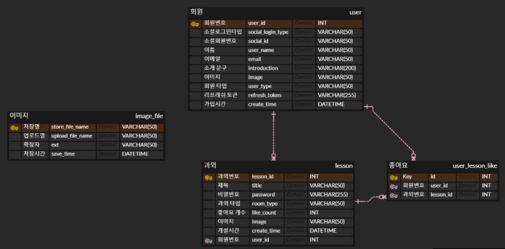
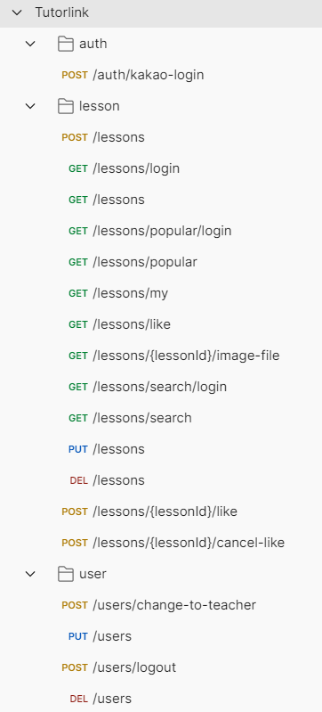

# TutorLink

온라인 과외 중개 서비스

### 팀원

노호준 (https://github.com/codeehh)

### 배포 환경

- AWS EC2 Linux

- Jenkins 자동 배포

### 기술 스택

- Java 11

- Spring Boot

- Spring Data JPA

- MySQL

- JWT

- Websocket

- Redis

- Rest Docs

### 구현 기능

##### 인증

- 소셜 로그인

- jwt 토큰 인증

##### 과외

- CRUD
- 조회 캐싱
- 검색 기능
- 좋아요 기능

##### 채팅

- 웹 소켓 채팅

### ERD

### API

